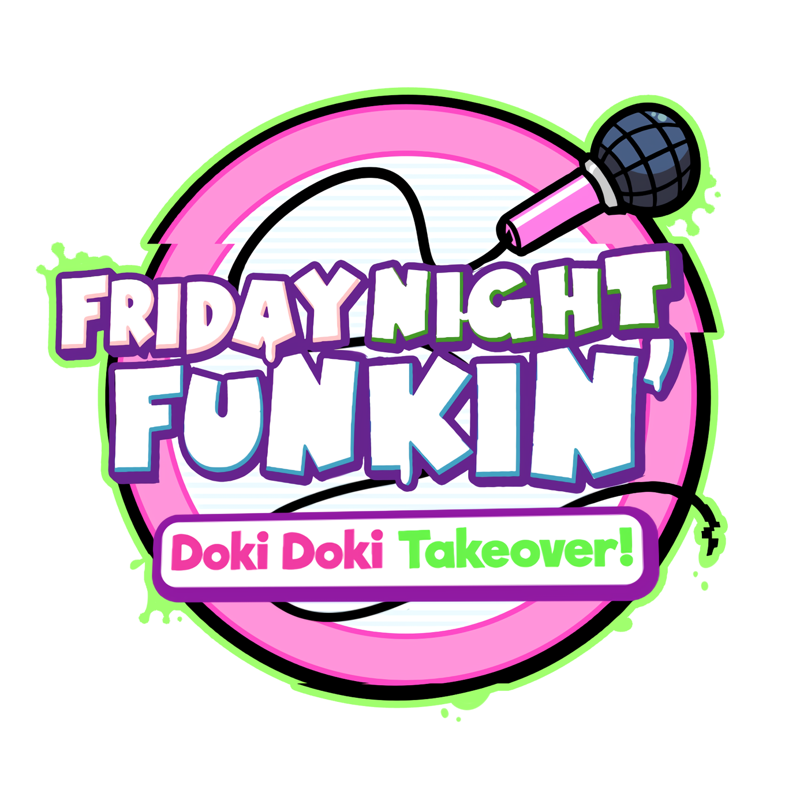

## Built on **[Kade Engine](https://github.com/KadeDev/Kade-Engine)** - **[GameBanana](https://gamebanana.com/mods/47364)** - **[Game Jolt](https://gamejolt.com/games/dokidoki/654415)**

# Original Game Links

FNF Links: **[itch.io page](https://ninja-muffin24.itch.io/funkin) ⋅ [Newgrounds](https://www.newgrounds.com/portal/view/770371) ⋅ [source code on GitHub](https://github.com/ninjamuffin99/Funkin)**

DDLC Links: **[DDLC Official Website](http://ddlc.moe) ⋅ [itch.io page](https://teamsalvato.itch.io/ddlc) ⋅ [Steam page](https://store.steampowered.com/app/698780/Doki_Doki_Literature_Club)**

DDLC+ Links: **[DDLC+ Official Website](http://ddlc.plus) ⋅ [Steam page](https://store.steampowered.com/app/1388880/Doki_Doki_Literature_Club_Plus)**

# Credits

### Doki Doki Takeover
- [Jorge_SunSpirit](https://twitter.com/Jorge_SunSpirit) and [M&M](https://twitter.com/ActualMandM) - Programming
- [SirDusterBuster](https://twitter.com/SirDusterBuster) and [TokyoGalaxyOG](https://twitter.com/TokyoGalaxyOG) - Art
- [CelShader](https://www.youtube.com/channel/UCm3eGs2etEOMzRX0iQ4QzqQ), [ClemO](https://twitter.com/ClemO___O), [HighPoweredKeyz](https://twitter.com/HighPoweredArt), [Kallionic](https://youtube.com/kallionic), [kekb](https://www.youtube.com/channel/UCbty7MoajjV1ZbmYz2OtDLw/videos), [Matt$](https://twitter.com/matt_currency), [Saruky](https://twitter.com/Saruky__), [Starrie_blu](https://twitter.com/starrie_blu), [Stardust Tunes](https://twitter.com/StardustTunes), [Tony Astro](https://twitter.com/TonyAstroVEVO) - Music
- [Esther Christo, voice of Monika](https://twitter.com/carimellevo)
- [Miss Beepy, voice of Natsuki](https://twitter.com/MissBeepy)
- [Loganne Digma, voice of Yuri](https://twitter.com/Loganne_Digma)
- [Phebe Fabacher, voice of Sayori](https://twitter.com/HarudoriVA)
- [Sulayre, Spanish translation](https://twitter.com/Sulayre)
- [SoftTurnip. French translation](https://twitter.com/Ruffles_Savoie)
- [Clem, Russian Translation](https://twitter.com/ClemO___O)
- [CrimiiCrim, Dutch Translation](https://twitter.com/CrimiiCrim)
- [SouLegal, Brazilian Portuguese Translation](https://twitter.com/nickstwt)
- [Aizakku, Brazilian Portuguese Translation](https://gamebanana.com/members/1875729)

### Special Thanks

- [Blantados](https://www.youtube.com/channel/UC4rwJYVeDHxGKnFDhHz88ZQ) - Vocals/Charting of "Your Reality"
- [aśh](https://gamebanana.com/members/1813477) - Implement Alt animations per note and helped add end song cutscenes.
- [Lumitic](https://twitter.com/PeacefulLuma) - Mad lad that actually knows how to code and helped with the project.
- [Zeexel32](https://twitter.com/Zeexel32) - Some general bug fixes/coding help.
- [foomfs](https://twitter.com/foomfs) - Thumbnail Design 
- [Matt$](https://twitter.com/matt_currency) - Remastering Monika Vocals
- [Cval](https://twitter.com/cval_brown) - Charting "Bara no Yume"
- [eishiya](https://twitter.com/DerpTree) - [LanaPixel](https://opengameart.org/content/lanapixel-localization-friendly-pixel-font)
- [ivory](https://twitter.com/ioIetsgo) - Linux compilation

### Friday Night Funkin'
 - [ninjamuffin99](https://twitter.com/ninja_muffin99) - Programming
 - [PhantomArcade3K](https://twitter.com/phantomarcade3k) and [Evilsk8r](https://twitter.com/evilsk8r) - Art
 - [Kawai Sprite](https://twitter.com/kawaisprite) - Music

### Doki Doki Literature Club!
- [Dan Salvato](https://twitter.com/dansalvato) - Creator of DDLC
- [Team Salvato](https://twitter.com/TeamSalvato) - Publishers of DDLC

### Kade Engine
- [KadeDev](https://twitter.com/KadeDeveloper) - Maintainer and lead programmer
- [The contributors](https://github.com/KadeDev/Kade-Engine/graphs/contributors)
